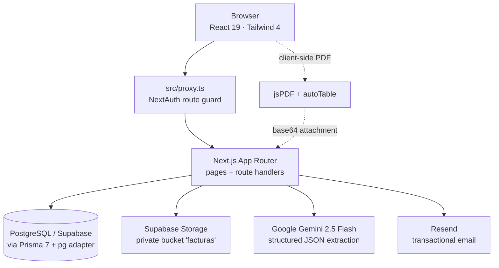
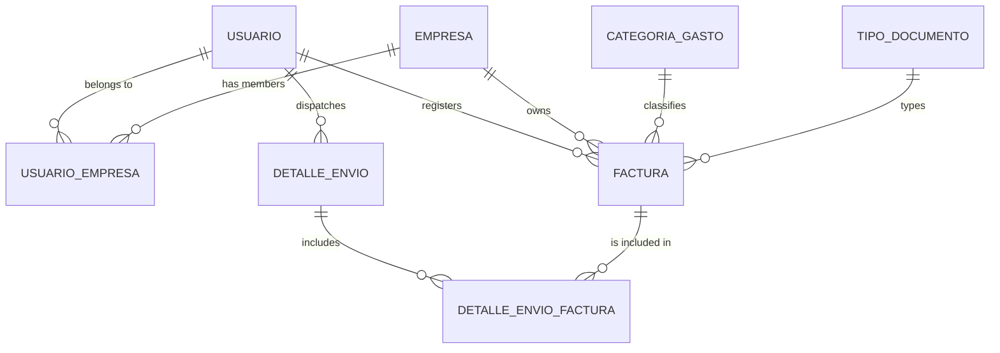
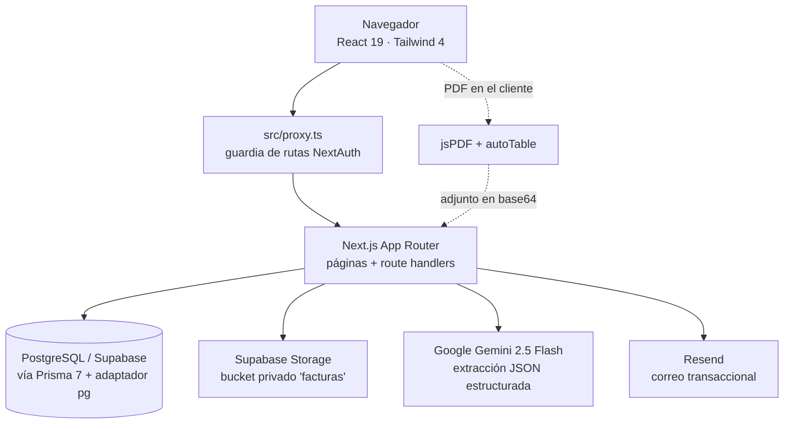
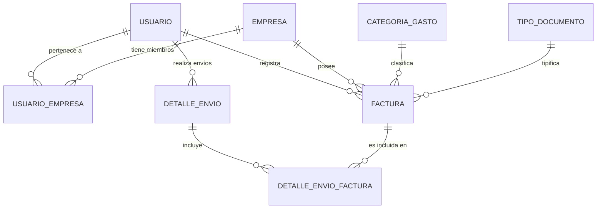

<div align="center">


# FactusAI

**Invoice capture, classification and reporting — powered by AI.**
**Captura, clasificación y reporte de facturas — potenciado por IA.**

[](https://nextjs.org)
[](https://react.dev)
[](https://www.typescriptlang.org)
[](https://www.prisma.io)
[](https://supabase.com)
[](https://tailwindcss.com)
[](https://ai.google.dev)

**[English](#-english) · [Español](#-español)**

</div>

---

# 🇬🇧 English

## Table of contents

- [Overview](#overview)
- [Key features](#key-features)
- [Tech stack](#tech-stack)
- [Architecture](#architecture)
- [Getting started](#getting-started)
- [Environment variables](#environment-variables)
- [Database](#database)
- [Project structure](#project-structure)
- [Application routes](#application-routes)
- [API reference](#api-reference)
- [Core flows](#core-flows)
- [Available scripts](#available-scripts)
- [Deployment](#deployment)
- [Security notes](#security-notes)
- [Troubleshooting](#troubleshooting)

## Overview

**FactusAI** is a web application that lets small businesses and independent professionals digitise their expense and income receipts without manual data entry. The user uploads a photo or PDF of a receipt, **Google Gemini** reads the date, supplier, amount and suggests an expense category, and the user simply confirms or corrects the result before saving.

Stored invoices can then be filtered by month and category, summarised in a monthly report, exported to a branded PDF, emailed to an accountant, or shared over WhatsApp — with every dispatch recorded in an activity log.

The project was built as part of a Software Engineering seminar (*Seminario de Software*), and its default locale, currency (`PEN`, Peruvian sol) and prompt wording target the Peruvian market.

## Key features

| Feature | Description |
| --- | --- |
| 🔐 **Credential authentication** | Sign-up and sign-in with email and password, hashed with `bcrypt` (12 rounds). Sessions handled by NextAuth v4 with a JWT strategy. |
| 🤖 **AI extraction** | Gemini 2.5 Flash reads images and PDFs and returns structured JSON (`fecha`, `proveedor`, `monto`, `categoriaSugerida`) validated server-side. |
| 🗂️ **Automatic categorisation** | The suggested category is matched against the catalogue using accent-insensitive exact, partial and fallback matching. |
| ☁️ **Secure file storage** | Receipts are stored in a private Supabase Storage bucket, namespaced per user, and served through time-limited signed URLs (1 hour). |
| 📊 **Dashboard** | Total invoices, invoices for the current month, monthly expense total and the three most recent records. |
| 🧾 **Invoice management** | List with month/category filters, detail view, inline editing and deletion (which also removes the stored file). |
| 📄 **PDF reports** | Monthly report generated client-side with `jsPDF` + `jspdf-autotable`: header, summary cards, totals table and detailed invoice table with pagination footer. |
| ✉️ **Email delivery** | The report is sent through **Resend** as responsive HTML with the PDF attached. |
| 💬 **WhatsApp sharing** | Uses the Web Share API to attach the PDF when supported, and falls back to a `wa.me` text summary. |
| 🕒 **Activity log** | Every email or WhatsApp dispatch is persisted with recipient, channel, status and the invoices included. |

## Tech stack

| Layer | Technology |
| --- | --- |
| Framework | Next.js 16.2.6 (App Router, Route Handlers, Proxy) |
| UI | React 19.2.4, Tailwind CSS 4, `lucide-react`, `sonner` |
| Language | TypeScript 5 |
| ORM | Prisma 7.8 with driver adapters (`@prisma/adapter-pg`, `pg`) |
| Database | PostgreSQL (Supabase) |
| Auth | NextAuth v4 (Credentials provider, JWT sessions, `@auth/prisma-adapter`, `bcryptjs`) |
| AI | `@google/generative-ai` — model `gemini-2.5-flash` with JSON response schema |
| Storage | Supabase Storage (`@supabase/supabase-js`, service role key) |
| Email | Resend |
| PDF | `jspdf`, `jspdf-autotable` |
| Hosting | Vercel (region `iad1`) |

> **Note on Next.js 16** — Middleware has been renamed to **Proxy**. Route protection therefore lives in [`src/proxy.ts`](src/proxy.ts), not in a `middleware.ts` file. See `node_modules/next/dist/docs/01-app/01-getting-started/16-proxy.md`.

## Architecture



**Request lifecycle**

1. `src/proxy.ts` protects every page except `/auth/*`, `/api/*`, `/_next/*`, `/favicon.ico` and `/assets/*`, redirecting anonymous visitors to `/auth/login`.
2. Every route handler independently calls `getAuthUserId()` ([`src/lib/api-auth.ts`](src/lib/api-auth.ts)) and returns `401` when there is no valid session — the proxy is an optimistic check, not the authorisation boundary.
3. Queries are always scoped by `usuarioId`, so a user can only ever read or mutate their own invoices.

## Getting started

### Prerequisites

- **Node.js 20+** and npm
- A **PostgreSQL** database (a Supabase project is recommended, as it also provides Storage)
- A **Google AI Studio** API key (optional — without it the app still works, with manual data entry)
- A **Resend** API key (optional — required only to email reports)

### Installation

```bash
# 1. Clone the repository
git clone <repository-url>
cd factusai

# 2. Install dependencies
npm install

# 3. Create your environment file
cp .env.example .env
#    …then fill in the values described below

# 4. Generate the Prisma client and apply migrations
npx prisma generate
npx prisma migrate deploy      # use `migrate dev` in a local dev database

# 5. Seed the catalogues (expense categories and document types)
npm run db:seed

# 6. Start the development server
npm run dev
```

Open [http://localhost:3000](http://localhost:3000), create an account at `/auth/register` and sign in.

### Supabase Storage setup

1. In your Supabase project, create a bucket named **`facturas`** and keep it **private**.
2. Copy the **service role** key from *Project Settings → API* into `SUPABASE_SERVICE_ROLE_KEY`.

The bucket URL is inferred from `DATABASE_URL` when you host Postgres on Supabase; set `NEXT_PUBLIC_SUPABASE_URL` explicitly only if your database lives elsewhere.

## Environment variables

| Variable | Required | Description |
| --- | :---: | --- |
| `DATABASE_URL` | ✅ | Postgres connection string used by the application at runtime (pooled connection recommended). |
| `DIRECT_URL` | ✅ | Direct (non-pooled) connection string used by Prisma migrations and the seed script. |
| `NEXTAUTH_SECRET` | ✅ | Secret used to sign NextAuth JWTs. `AUTH_SECRET` is accepted as an alias. Generate with `openssl rand -base64 32`. |
| `NEXTAUTH_URL` | ✅ | Public base URL of the deployment (`http://localhost:3000` in development). |
| `SUPABASE_SERVICE_ROLE_KEY` | ✅ | Supabase service role key — grants server-side access to Storage. **Never expose it to the client.** |
| `SUPABASE_FACTURAS_BUCKET` | ➖ | Bucket name for receipts. Defaults to `facturas`. |
| `NEXT_PUBLIC_SUPABASE_URL` | ➖ | Supabase project URL. Only needed when Postgres is not hosted on Supabase. |
| `GEMINI_API_KEY` | ➖ | Google AI Studio key. Without it, `/api/facturas/extract` returns `503` and the form falls back to manual entry. |
| `RESEND_API_KEY` | ➖ | Resend key. Required only for `/api/send-report`. |

> ⚠️ `.env` is git-ignored. `.env.example` currently documents the database, NextAuth and Supabase variables; remember to also set `GEMINI_API_KEY` and `RESEND_API_KEY` if you want the AI and email features.

## Database

The schema lives in [`prisma/schema.prisma`](prisma/schema.prisma) and maps to snake_case Spanish table names.



| Model | Table | Purpose |
| --- | --- | --- |
| `Usuario` | `usuario` | Authenticated user: unique identifier, name, email, bcrypt password hash, status. |
| `Empresa` | `empresa` | Business the invoices belong to. One is auto-created on registration. |
| `UsuarioEmpresa` | `usuario_empresa` | Many-to-many link between users and businesses. |
| `CategoriaGasto` | `categoria_gasto` | Expense category catalogue (seeded). |
| `TipoDocumento` | `tipo_documento` | Document type catalogue (seeded). |
| `Factura` | `factura` | Invoice: date, supplier, amount `Decimal(12,2)`, file path, physical-copy flag, notes and foreign keys. |
| `DetalleEnvio` | `detalle_envio` | Dispatch record: timestamp, recipient, channel and status. |
| `DetalleEnvioFactura` | `detalle_envio_factura` | Many-to-many link between a dispatch and the invoices it contained. |
| `Cliente` | `Cliente` | Legacy table retained from the initial migration; not used by the application. |

**Enums** — `EstadoUsuario` (`Activo`, `Inactivo`, `Suspendido`) · `TipoFactura` (`Credito`, `Contado`) · `TipoMovimiento` (`Ingreso`, `Gasto`) · `MedioEnvio` (`Email`, `WhatsApp`, `Otro`) · `EstadoEnvio` (`Enviado`, `Fallido`, `Entregado`).

**Seed data** ([`prisma/seed.ts`](prisma/seed.ts), idempotent) — categories: *Alimentación, Transporte, Salud, Servicios, Oficina, Otros*; document types: *Factura, Boleta, Recibo, Nota de crédito, Ticket*.

## Project structure

```
factusai/
├── prisma/
│   ├── migrations/               # SQL migration history
│   ├── schema.prisma             # Data model
│   └── seed.ts                   # Catalogue seeding
├── public/assets/                # Logos
├── src/
│   ├── app/
│   │   ├── api/                  # Route handlers (see API reference)
│   │   ├── auth/                 # login · register
│   │   ├── activity/             # Dispatch history
│   │   ├── invoices/             # List and [id] detail
│   │   ├── reports/              # Monthly report
│   │   ├── upload/               # AI-assisted upload
│   │   ├── layout.tsx            # Root layout, fonts, providers, toaster
│   │   ├── page.tsx              # Dashboard
│   │   └── globals.css           # Tailwind 4 theme (brand tokens)
│   ├── components/
│   │   ├── auth/                 # AuthSplitLayout
│   │   ├── facturas/             # FacturaForm (shared create/edit form)
│   │   ├── layout/               # AppShell · Navbar · Sidebar
│   │   └── providers/            # SessionProvider
│   ├── lib/
│   │   ├── api-auth.ts           # Session helper for route handlers
│   │   ├── api-errors.ts         # Safe user-facing messages
│   │   ├── auth.ts               # NextAuth configuration
│   │   ├── client-errors.ts      # Client-side error normalisation
│   │   ├── empresa.ts            # get-or-create business for a user
│   │   ├── facturas.ts           # Includes, serialisers, month filter
│   │   ├── gemini.ts             # Extraction prompt, schema and matcher
│   │   ├── prisma.ts             # Singleton Prisma client
│   │   ├── report-pdf.ts         # PDF builder
│   │   └── supabase.ts           # Storage client and signed URLs
│   ├── types/                    # Shared DTOs and NextAuth augmentation
│   └── proxy.ts                  # Route protection (Next.js 16 Proxy)
├── next.config.ts
├── prisma.config.ts
└── vercel.json
```

## Application routes

| Route | Access | Description |
| --- | --- | --- |
| `/` | Private | Dashboard with summary cards and latest invoices. |
| `/upload` | Private | Upload a receipt, run AI extraction and register the invoice. |
| `/invoices` | Private | Invoice list with month and category filters. |
| `/invoices/[id]` | Private | Detail view with signed receipt URL, editing and deletion. |
| `/reports` | Private | Monthly report: totals, table, PDF download, email and WhatsApp. |
| `/activity` | Private | History of report dispatches. |
| `/auth/login` | Public | Sign in. |
| `/auth/register` | Public | Create an account (also creates a business and its link). |

## API reference

All endpoints require an authenticated session unless stated otherwise and respond with `401 { "message": "No autorizado." }` when it is missing.

### Authentication

| Method | Endpoint | Description |
| --- | --- | --- |
| `GET` `POST` | `/api/auth/[...nextauth]` | NextAuth handlers (sign in, sign out, session). **Public.** |
| `POST` | `/api/auth/register` | Creates a user, its business and the link, in a single transaction. **Public.** |

<details>
<summary><code>POST /api/auth/register</code></summary>

```jsonc
// Request
{ "nombre": "Ada Lovelace", "correo": "ada@example.com", "contrasena": "••••••••" }

// 201 Created
{ "message": "Usuario registrado correctamente." }
// 400 missing fields · 409 email already registered · 500 internal error
```
</details>

### Catalogues and dashboard

| Method | Endpoint | Description |
| --- | --- | --- |
| `GET` | `/api/catalogos` | Returns `{ categorias, tiposDocumento }`, both sorted by name. |
| `GET` | `/api/dashboard` | Returns `{ totalFacturas, facturasMes, montoMesGastos, ultimas }` for the current month. |

### Invoices

| Method | Endpoint | Description |
| --- | --- | --- |
| `GET` | `/api/facturas` | Lists the user's invoices. Query: `mes=YYYY-MM`, `categoriaId`. |
| `POST` | `/api/facturas` | Creates an invoice. Validates date, supplier, positive amount, category, document type and enums. |
| `GET` | `/api/facturas/[id]` | Invoice detail, including a signed `imagenUrl` valid for one hour. |
| `PATCH` | `/api/facturas/[id]` | Partial update — unspecified fields keep their current value. |
| `DELETE` | `/api/facturas/[id]` | Deletes the invoice and its stored file. |
| `POST` | `/api/facturas/upload` | Uploads the receipt to Supabase Storage and returns `{ path }`. |
| `POST` | `/api/facturas/extract` | Runs AI extraction on the file and returns the suggested fields. |

<details>
<summary><code>POST /api/facturas</code></summary>

```jsonc
// Request
{
  "fecha": "2026-08-05",              // YYYY-MM-DD
  "proveedor": "Supermercados Peruanos",
  "monto": 149.90,                     // > 0
  "categoriaGastoId": 1,
  "tipoDocumentoId": 2,
  "tipoMovimiento": "Gasto",          // Ingreso | Gasto
  "tipoFactura": "Contado",           // Contado | Credito
  "imagen": "12/9f0c….jpg",           // storage path returned by /upload
  "observaciones": null
}

// 201 Created → { "factura": { … } }
// 400 validation error · 500 internal error
```
</details>

<details>
<summary><code>POST /api/facturas/upload</code> · <code>POST /api/facturas/extract</code></summary>

Both accept `multipart/form-data` with a single `file` field.

- **Allowed types:** `image/jpeg`, `image/png`, `image/webp`, `image/gif`, `application/pdf`
- **Maximum size:** 10 MB

```jsonc
// upload → 200 OK
{ "path": "12/9f0c1c7e-….jpg" }        // stored as {usuarioId}/{uuid}.{ext}

// extract → 200 OK
{
  "fecha": "2026-08-05",
  "proveedor": "Supermercados Peruanos",
  "monto": 149.9,
  "categoriaSugerida": "Alimentación",
  "categoriaGastoId": 1                 // null when no match was possible
}

// 400 invalid file · 422 unreadable receipt · 503 service not configured
```
</details>

### Reports and activity

| Method | Endpoint | Description |
| --- | --- | --- |
| `POST` | `/api/send-report` | Sends the HTML report with the PDF attached via Resend and logs the dispatch. Body: `email`, `mes`, `htmlContent`, `pdfBase64`, `pdfFileName`, `facturasIds`. |
| `GET` | `/api/activity` | Dispatch history, newest first. |
| `POST` | `/api/activity` | Logs a dispatch (used by the WhatsApp flow). Body: `destinatario`, `medioEnvio`, `facturasIds`. |

## Core flows

### 1 · AI-assisted registration

```
Select file → POST /api/facturas/extract → Gemini 2.5 Flash (JSON schema)
   → server-side validation (date format, non-empty supplier, amount > 0)
   → category matching against the catalogue
   → form pre-filled; the user confirms or corrects
   → POST /api/facturas/upload (file → Storage)
   → POST /api/facturas (record → database)
```

The file is uploaded **only when the form is submitted**, so abandoned drafts leave no orphaned objects in the bucket. Extraction requests are tagged with an incrementing id so a slower earlier response can never overwrite a newer one.

### 2 · Monthly report

```
GET /api/facturas?mes=YYYY-MM
   → totals computed client-side (income, expenses, balance)
   → jsPDF + autoTable build the document in the browser
   → Download  ·  Email (base64 → Resend)  ·  WhatsApp (Web Share API or wa.me)
   → the dispatch is recorded in detalle_envio
```

### 3 · Receipt storage

Files are stored under `{usuarioId}/{uuid}.{ext}` in a private bucket. Only the path is persisted in the database; a **signed URL valid for one hour** is generated on demand when an invoice detail is requested. Deleting an invoice also removes its object from Storage.

## Available scripts

| Command | Description |
| --- | --- |
| `npm run dev` | Start the development server on port 3000. |
| `npm run build` | Production build. |
| `npm run start` | Serve the production build. |
| `npm run lint` | Run ESLint (`eslint-config-next`). |
| `npm run db:seed` | Seed categories and document types. |
| `npx prisma generate` | Generate the Prisma client into `generated/prisma`. |
| `npx prisma migrate dev` | Create and apply a migration in development. |
| `npx prisma migrate deploy` | Apply pending migrations in production. |
| `npx prisma studio` | Browse the database in a local UI. |

## Deployment

The project is configured for **Vercel** through [`vercel.json`](vercel.json):

```json
{
  "buildCommand": "prisma generate && next build",
  "installCommand": "npm install",
  "framework": "nextjs",
  "regions": ["iad1"]
}
```

**Checklist**

1. Declare every environment variable in *Project Settings → Environment Variables*.
2. Set `NEXTAUTH_URL` to the production domain.
3. Use the **pooled** connection string for `DATABASE_URL` and the **direct** one for `DIRECT_URL`.
4. Run `npx prisma migrate deploy` against the production database before the first release.
5. Run the seed once so the catalogues are populated.
6. To send email from your own domain, verify it in Resend and replace the sender in [`src/app/api/send-report/route.ts`](src/app/api/send-report/route.ts) — it currently uses Resend's `onboarding@resend.dev` sandbox address, which can only deliver to the account owner.

## Security notes

- Passwords are hashed with `bcrypt` at cost factor 12 and never returned by any endpoint.
- Sessions are JWTs signed with `NEXTAUTH_SECRET`; only the user id is stored in the token.
- Every query filters by `usuarioId`, preventing horizontal access between accounts.
- The service role key is used exclusively on the server; the bucket stays private and is reached through signed URLs.
- Internal errors are logged on the server while the client receives generic messages from `USER_MESSAGES` ([`src/lib/api-errors.ts`](src/lib/api-errors.ts)), avoiding stack-trace leakage.
- Uploads are restricted by MIME type and size, and filenames are replaced with a UUID plus a sanitised extension.

## Troubleshooting

| Symptom | Likely cause and fix |
| --- | --- |
| `503` and *"El reconocimiento con IA no está disponible"* | `GEMINI_API_KEY` is missing or blank. The form still works manually. |
| `El servicio de archivos no está disponible` | Supabase is not configured: check `SUPABASE_SERVICE_ROLE_KEY` and that the project URL can be inferred from `DATABASE_URL`. |
| Empty category or document type dropdowns | The seed has not been run — execute `npm run db:seed`. |
| `PrismaClientInitializationError` | `DATABASE_URL` is unreachable, or `npx prisma generate` has not been run after installing. |
| Report email never arrives | `RESEND_API_KEY` is missing, or you are using the sandbox sender, which only delivers to the Resend account owner. |
| Receipt image does not render | The signed URL has expired (one hour) — reload the invoice detail. |

---

# 🇪🇸 Español

## Tabla de contenidos

- [Descripción general](#descripción-general)
- [Características principales](#características-principales)
- [Stack tecnológico](#stack-tecnológico)
- [Arquitectura](#arquitectura)
- [Puesta en marcha](#puesta-en-marcha)
- [Variables de entorno](#variables-de-entorno)
- [Base de datos](#base-de-datos)
- [Estructura del proyecto](#estructura-del-proyecto)
- [Rutas de la aplicación](#rutas-de-la-aplicación)
- [Referencia de la API](#referencia-de-la-api)
- [Flujos principales](#flujos-principales)
- [Scripts disponibles](#scripts-disponibles)
- [Despliegue](#despliegue)
- [Notas de seguridad](#notas-de-seguridad)
- [Solución de problemas](#solución-de-problemas)

## Descripción general

**FactusAI** es una aplicación web que permite a pequeños negocios y profesionales independientes digitalizar sus comprobantes de gasto e ingreso sin digitación manual. El usuario sube una foto o PDF del comprobante, **Google Gemini** lee la fecha, el proveedor y el monto, sugiere una categoría de gasto, y el usuario solo confirma o corrige antes de guardar.

Las facturas almacenadas pueden filtrarse por mes y categoría, resumirse en un reporte mensual, exportarse a un PDF con identidad visual, enviarse por correo a la contadora o compartirse por WhatsApp; cada envío queda registrado en un historial de actividad.

El proyecto se desarrolló en el marco de un *Seminario de Software*, y su idioma, moneda (`PEN`, soles) y redacción de prompts están orientados al mercado peruano.

## Características principales

| Característica | Descripción |
| --- | --- |
| 🔐 **Autenticación con credenciales** | Registro e inicio de sesión con correo y contraseña, cifrada con `bcrypt` (12 rondas). Sesiones gestionadas por NextAuth v4 con estrategia JWT. |
| 🤖 **Extracción con IA** | Gemini 2.5 Flash lee imágenes y PDF y devuelve un JSON estructurado (`fecha`, `proveedor`, `monto`, `categoriaSugerida`) validado en el servidor. |
| 🗂️ **Categorización automática** | La categoría sugerida se contrasta con el catálogo mediante coincidencia exacta, parcial y de respaldo, insensible a tildes. |
| ☁️ **Almacenamiento seguro** | Los comprobantes se guardan en un bucket privado de Supabase Storage, separados por usuario y servidos mediante URL firmadas de una hora. |
| 📊 **Panel de control** | Total de facturas, facturas del mes en curso, gasto acumulado del mes y los tres registros más recientes. |
| 🧾 **Gestión de facturas** | Listado con filtros de mes y categoría, vista de detalle, edición en línea y eliminación (que también borra el archivo almacenado). |
| 📄 **Reportes en PDF** | Reporte mensual generado en el navegador con `jsPDF` + `jspdf-autotable`: cabecera, tarjetas de resumen, tabla de totales y detalle de facturas con pie paginado. |
| ✉️ **Envío por correo** | El reporte se envía mediante **Resend** en HTML adaptable, con el PDF adjunto. |
| 💬 **Compartir por WhatsApp** | Usa la Web Share API para adjuntar el PDF cuando el dispositivo lo permite, con respaldo a un resumen de texto vía `wa.me`. |
| 🕒 **Historial de actividad** | Cada envío por correo o WhatsApp se persiste con destinatario, medio, estado y las facturas incluidas. |

## Stack tecnológico

| Capa | Tecnología |
| --- | --- |
| Framework | Next.js 16.2.6 (App Router, Route Handlers, Proxy) |
| Interfaz | React 19.2.4, Tailwind CSS 4, `lucide-react`, `sonner` |
| Lenguaje | TypeScript 5 |
| ORM | Prisma 7.8 con driver adapters (`@prisma/adapter-pg`, `pg`) |
| Base de datos | PostgreSQL (Supabase) |
| Autenticación | NextAuth v4 (proveedor Credentials, sesiones JWT, `@auth/prisma-adapter`, `bcryptjs`) |
| IA | `@google/generative-ai` — modelo `gemini-2.5-flash` con esquema de respuesta JSON |
| Almacenamiento | Supabase Storage (`@supabase/supabase-js`, service role key) |
| Correo | Resend |
| PDF | `jspdf`, `jspdf-autotable` |
| Hosting | Vercel (región `iad1`) |

> **Nota sobre Next.js 16** — el *Middleware* pasó a llamarse **Proxy**. Por eso la protección de rutas vive en [`src/proxy.ts`](src/proxy.ts) y no en un archivo `middleware.ts`. Consulte `node_modules/next/dist/docs/01-app/01-getting-started/16-proxy.md`.

## Arquitectura



**Ciclo de una petición**

1. `src/proxy.ts` protege todas las páginas excepto `/auth/*`, `/api/*`, `/_next/*`, `/favicon.ico` y `/assets/*`, y redirige a `/auth/login` a las visitas anónimas.
2. Cada route handler llama de forma independiente a `getAuthUserId()` ([`src/lib/api-auth.ts`](src/lib/api-auth.ts)) y responde `401` si no hay sesión válida: el proxy es una comprobación optimista, no la frontera de autorización.
3. Todas las consultas se acotan por `usuarioId`, de modo que un usuario solo puede leer o modificar sus propias facturas.

## Puesta en marcha

### Requisitos previos

- **Node.js 20+** y npm
- Una base de datos **PostgreSQL** (se recomienda un proyecto de Supabase, que además aporta el Storage)
- Una API key de **Google AI Studio** (opcional; sin ella la aplicación funciona con carga manual)
- Una API key de **Resend** (opcional; solo necesaria para enviar reportes por correo)

### Instalación

```bash
# 1. Clonar el repositorio
git clone <url-del-repositorio>
cd factusai

# 2. Instalar dependencias
npm install

# 3. Crear el archivo de entorno
cp .env.example .env
#    …y completar los valores descritos más abajo

# 4. Generar el cliente de Prisma y aplicar las migraciones
npx prisma generate
npx prisma migrate deploy      # use `migrate dev` en una base local de desarrollo

# 5. Sembrar los catálogos (categorías de gasto y tipos de documento)
npm run db:seed

# 6. Iniciar el servidor de desarrollo
npm run dev
```

Abra [http://localhost:3000](http://localhost:3000), cree una cuenta en `/auth/register` e inicie sesión.

### Configuración de Supabase Storage

1. En su proyecto de Supabase, cree un bucket llamado **`facturas`** y manténgalo **privado**.
2. Copie la clave **service role** desde *Project Settings → API* en `SUPABASE_SERVICE_ROLE_KEY`.

La URL del proyecto se infiere de `DATABASE_URL` cuando Postgres está alojado en Supabase; defina `NEXT_PUBLIC_SUPABASE_URL` de forma explícita solo si su base de datos está en otro proveedor.

## Variables de entorno

| Variable | Obligatoria | Descripción |
| --- | :---: | --- |
| `DATABASE_URL` | ✅ | Cadena de conexión a Postgres usada por la aplicación en tiempo de ejecución (se recomienda la conexión con pool). |
| `DIRECT_URL` | ✅ | Cadena de conexión directa (sin pool) que usan las migraciones de Prisma y el script de siembra. |
| `NEXTAUTH_SECRET` | ✅ | Secreto para firmar los JWT de NextAuth. Se acepta `AUTH_SECRET` como alias. Genérelo con `openssl rand -base64 32`. |
| `NEXTAUTH_URL` | ✅ | URL base pública del despliegue (`http://localhost:3000` en desarrollo). |
| `SUPABASE_SERVICE_ROLE_KEY` | ✅ | Clave service role de Supabase; otorga acceso al Storage desde el servidor. **Nunca debe exponerse al cliente.** |
| `SUPABASE_FACTURAS_BUCKET` | ➖ | Nombre del bucket de comprobantes. Por defecto `facturas`. |
| `NEXT_PUBLIC_SUPABASE_URL` | ➖ | URL del proyecto Supabase. Solo necesaria si Postgres no está alojado en Supabase. |
| `GEMINI_API_KEY` | ➖ | Clave de Google AI Studio. Sin ella, `/api/facturas/extract` responde `503` y el formulario se completa manualmente. |
| `RESEND_API_KEY` | ➖ | Clave de Resend. Necesaria únicamente para `/api/send-report`. |

> ⚠️ `.env` está excluido de Git. `.env.example` documenta hoy las variables de base de datos, NextAuth y Supabase; recuerde definir también `GEMINI_API_KEY` y `RESEND_API_KEY` si desea usar la IA y el envío de correo.

## Base de datos

El esquema se define en [`prisma/schema.prisma`](prisma/schema.prisma) y mapea a tablas en español con nomenclatura snake_case.



| Modelo | Tabla | Propósito |
| --- | --- | --- |
| `Usuario` | `usuario` | Usuario autenticado: identificador único, nombre, correo, hash bcrypt de la contraseña y estado. |
| `Empresa` | `empresa` | Negocio al que pertenecen las facturas. Se crea automáticamente al registrarse. |
| `UsuarioEmpresa` | `usuario_empresa` | Relación muchos a muchos entre usuarios y empresas. |
| `CategoriaGasto` | `categoria_gasto` | Catálogo de categorías de gasto (sembrado). |
| `TipoDocumento` | `tipo_documento` | Catálogo de tipos de documento (sembrado). |
| `Factura` | `factura` | Factura: fecha, proveedor, monto `Decimal(12,2)`, ruta del archivo, indicador de copia física, observaciones y llaves foráneas. |
| `DetalleEnvio` | `detalle_envio` | Registro de envío: marca de tiempo, destinatario, medio y estado. |
| `DetalleEnvioFactura` | `detalle_envio_factura` | Relación muchos a muchos entre un envío y las facturas que incluyó. |
| `Cliente` | `Cliente` | Tabla heredada de la migración inicial; la aplicación no la utiliza. |

**Enumeraciones** — `EstadoUsuario` (`Activo`, `Inactivo`, `Suspendido`) · `TipoFactura` (`Credito`, `Contado`) · `TipoMovimiento` (`Ingreso`, `Gasto`) · `MedioEnvio` (`Email`, `WhatsApp`, `Otro`) · `EstadoEnvio` (`Enviado`, `Fallido`, `Entregado`).

**Datos sembrados** ([`prisma/seed.ts`](prisma/seed.ts), idempotente) — categorías: *Alimentación, Transporte, Salud, Servicios, Oficina, Otros*; tipos de documento: *Factura, Boleta, Recibo, Nota de crédito, Ticket*.

## Estructura del proyecto

```
factusai/
├── prisma/
│   ├── migrations/               # Historial de migraciones SQL
│   ├── schema.prisma             # Modelo de datos
│   └── seed.ts                   # Siembra de catálogos
├── public/assets/                # Logotipos
├── src/
│   ├── app/
│   │   ├── api/                  # Route handlers (ver referencia de la API)
│   │   ├── auth/                 # login · register
│   │   ├── activity/             # Historial de envíos
│   │   ├── invoices/             # Listado y detalle [id]
│   │   ├── reports/              # Reporte mensual
│   │   ├── upload/               # Carga asistida por IA
│   │   ├── layout.tsx            # Layout raíz, fuentes, proveedores y toaster
│   │   ├── page.tsx              # Panel de control
│   │   └── globals.css           # Tema de Tailwind 4 (tokens de marca)
│   ├── components/
│   │   ├── auth/                 # AuthSplitLayout
│   │   ├── facturas/             # FacturaForm (formulario de alta y edición)
│   │   ├── layout/               # AppShell · Navbar · Sidebar
│   │   └── providers/            # SessionProvider
│   ├── lib/
│   │   ├── api-auth.ts           # Utilidad de sesión para route handlers
│   │   ├── api-errors.ts         # Mensajes seguros para el usuario
│   │   ├── auth.ts               # Configuración de NextAuth
│   │   ├── client-errors.ts      # Normalización de errores en cliente
│   │   ├── empresa.ts            # Obtener o crear la empresa de un usuario
│   │   ├── facturas.ts           # Includes, serializadores y filtro por mes
│   │   ├── gemini.ts             # Prompt, esquema y emparejador de categorías
│   │   ├── prisma.ts             # Cliente Prisma singleton
│   │   ├── report-pdf.ts         # Constructor del PDF
│   │   └── supabase.ts           # Cliente de Storage y URL firmadas
│   ├── types/                    # DTO compartidos y extensión de NextAuth
│   └── proxy.ts                  # Protección de rutas (Proxy de Next.js 16)
├── next.config.ts
├── prisma.config.ts
└── vercel.json
```

## Rutas de la aplicación

| Ruta | Acceso | Descripción |
| --- | --- | --- |
| `/` | Privada | Panel con tarjetas de resumen y últimas facturas. |
| `/upload` | Privada | Subir un comprobante, ejecutar la extracción con IA y registrar la factura. |
| `/invoices` | Privada | Listado de facturas con filtros de mes y categoría. |
| `/invoices/[id]` | Privada | Detalle con URL firmada del comprobante, edición y eliminación. |
| `/reports` | Privada | Reporte mensual: totales, tabla, descarga en PDF, correo y WhatsApp. |
| `/activity` | Privada | Historial de envíos de reportes. |
| `/auth/login` | Pública | Inicio de sesión. |
| `/auth/register` | Pública | Creación de cuenta (crea también la empresa y su vínculo). |

## Referencia de la API

Todos los endpoints requieren sesión autenticada salvo indicación contraria y responden `401 { "message": "No autorizado." }` cuando falta.

### Autenticación

| Método | Endpoint | Descripción |
| --- | --- | --- |
| `GET` `POST` | `/api/auth/[...nextauth]` | Handlers de NextAuth (inicio y cierre de sesión, sesión activa). **Pública.** |
| `POST` | `/api/auth/register` | Crea el usuario, su empresa y el vínculo entre ambos, en una sola transacción. **Pública.** |

<details>
<summary><code>POST /api/auth/register</code></summary>

```jsonc
// Petición
{ "nombre": "Ada Lovelace", "correo": "ada@ejemplo.com", "contrasena": "••••••••" }

// 201 Created
{ "message": "Usuario registrado correctamente." }
// 400 campos faltantes · 409 correo ya registrado · 500 error interno
```
</details>

### Catálogos y panel

| Método | Endpoint | Descripción |
| --- | --- | --- |
| `GET` | `/api/catalogos` | Devuelve `{ categorias, tiposDocumento }`, ambos ordenados por nombre. |
| `GET` | `/api/dashboard` | Devuelve `{ totalFacturas, facturasMes, montoMesGastos, ultimas }` del mes en curso. |

### Facturas

| Método | Endpoint | Descripción |
| --- | --- | --- |
| `GET` | `/api/facturas` | Lista las facturas del usuario. Query: `mes=YYYY-MM`, `categoriaId`. |
| `POST` | `/api/facturas` | Crea una factura. Valida fecha, proveedor, monto positivo, categoría, tipo de documento y enumeraciones. |
| `GET` | `/api/facturas/[id]` | Detalle de la factura, con `imagenUrl` firmada y válida por una hora. |
| `PATCH` | `/api/facturas/[id]` | Actualización parcial: los campos omitidos conservan su valor actual. |
| `DELETE` | `/api/facturas/[id]` | Elimina la factura y su archivo almacenado. |
| `POST` | `/api/facturas/upload` | Sube el comprobante a Supabase Storage y devuelve `{ path }`. |
| `POST` | `/api/facturas/extract` | Ejecuta la extracción con IA sobre el archivo y devuelve los campos sugeridos. |

<details>
<summary><code>POST /api/facturas</code></summary>

```jsonc
// Petición
{
  "fecha": "2026-08-05",              // YYYY-MM-DD
  "proveedor": "Supermercados Peruanos",
  "monto": 149.90,                     // > 0
  "categoriaGastoId": 1,
  "tipoDocumentoId": 2,
  "tipoMovimiento": "Gasto",          // Ingreso | Gasto
  "tipoFactura": "Contado",           // Contado | Credito
  "imagen": "12/9f0c….jpg",           // ruta devuelta por /upload
  "observaciones": null
}

// 201 Created → { "factura": { … } }
// 400 error de validación · 500 error interno
```
</details>

<details>
<summary><code>POST /api/facturas/upload</code> · <code>POST /api/facturas/extract</code></summary>

Ambos reciben `multipart/form-data` con un único campo `file`.

- **Tipos permitidos:** `image/jpeg`, `image/png`, `image/webp`, `image/gif`, `application/pdf`
- **Tamaño máximo:** 10 MB

```jsonc
// upload → 200 OK
{ "path": "12/9f0c1c7e-….jpg" }        // se guarda como {usuarioId}/{uuid}.{ext}

// extract → 200 OK
{
  "fecha": "2026-08-05",
  "proveedor": "Supermercados Peruanos",
  "monto": 149.9,
  "categoriaSugerida": "Alimentación",
  "categoriaGastoId": 1                 // null si no fue posible emparejar
}

// 400 archivo inválido · 422 comprobante ilegible · 503 servicio no configurado
```
</details>

### Reportes y actividad

| Método | Endpoint | Descripción |
| --- | --- | --- |
| `POST` | `/api/send-report` | Envía el reporte HTML con el PDF adjunto mediante Resend y registra el envío. Cuerpo: `email`, `mes`, `htmlContent`, `pdfBase64`, `pdfFileName`, `facturasIds`. |
| `GET` | `/api/activity` | Historial de envíos, del más reciente al más antiguo. |
| `POST` | `/api/activity` | Registra un envío (lo usa el flujo de WhatsApp). Cuerpo: `destinatario`, `medioEnvio`, `facturasIds`. |

## Flujos principales

### 1 · Registro asistido por IA

```
Seleccionar archivo → POST /api/facturas/extract → Gemini 2.5 Flash (esquema JSON)
   → validación en el servidor (formato de fecha, proveedor no vacío, monto > 0)
   → emparejamiento de la categoría con el catálogo
   → formulario precargado; el usuario confirma o corrige
   → POST /api/facturas/upload (archivo → Storage)
   → POST /api/facturas (registro → base de datos)
```

El archivo se sube **solo al enviar el formulario**, de modo que los borradores abandonados no dejan objetos huérfanos en el bucket. Cada solicitud de extracción lleva un identificador incremental, para que una respuesta anterior más lenta nunca sobrescriba a una más reciente.

### 2 · Reporte mensual

```
GET /api/facturas?mes=YYYY-MM
   → totales calculados en el cliente (ingresos, gastos, balance)
   → jsPDF + autoTable construyen el documento en el navegador
   → Descargar  ·  Correo (base64 → Resend)  ·  WhatsApp (Web Share API o wa.me)
   → el envío queda registrado en detalle_envio
```

### 3 · Almacenamiento de comprobantes

Los archivos se guardan como `{usuarioId}/{uuid}.{ext}` en un bucket privado. En la base de datos solo se persiste la ruta; la **URL firmada, válida por una hora**, se genera bajo demanda al consultar el detalle de una factura. Al eliminar una factura también se borra su objeto del Storage.

## Scripts disponibles

| Comando | Descripción |
| --- | --- |
| `npm run dev` | Inicia el servidor de desarrollo en el puerto 3000. |
| `npm run build` | Compilación de producción. |
| `npm run start` | Sirve la compilación de producción. |
| `npm run lint` | Ejecuta ESLint (`eslint-config-next`). |
| `npm run db:seed` | Siembra categorías y tipos de documento. |
| `npx prisma generate` | Genera el cliente de Prisma en `generated/prisma`. |
| `npx prisma migrate dev` | Crea y aplica una migración en desarrollo. |
| `npx prisma migrate deploy` | Aplica las migraciones pendientes en producción. |
| `npx prisma studio` | Explora la base de datos en una interfaz local. |

## Despliegue

El proyecto está configurado para **Vercel** mediante [`vercel.json`](vercel.json):

```json
{
  "buildCommand": "prisma generate && next build",
  "installCommand": "npm install",
  "framework": "nextjs",
  "regions": ["iad1"]
}
```

**Lista de verificación**

1. Declare todas las variables de entorno en *Project Settings → Environment Variables*.
2. Ajuste `NEXTAUTH_URL` al dominio de producción.
3. Use la cadena de conexión **con pool** en `DATABASE_URL` y la **directa** en `DIRECT_URL`.
4. Ejecute `npx prisma migrate deploy` contra la base de producción antes del primer despliegue.
5. Ejecute la siembra una vez para poblar los catálogos.
6. Para enviar correo desde su propio dominio, verifíquelo en Resend y reemplace el remitente en [`src/app/api/send-report/route.ts`](src/app/api/send-report/route.ts): actualmente usa la dirección de pruebas `onboarding@resend.dev`, que solo entrega al titular de la cuenta.

## Notas de seguridad

- Las contraseñas se cifran con `bcrypt` con factor de costo 12 y ningún endpoint las devuelve.
- Las sesiones son JWT firmados con `NEXTAUTH_SECRET`; el token solo almacena el identificador del usuario.
- Todas las consultas filtran por `usuarioId`, lo que impide el acceso horizontal entre cuentas.
- La clave service role se usa exclusivamente en el servidor; el bucket permanece privado y se accede mediante URL firmadas.
- Los errores internos se registran en el servidor mientras el cliente recibe mensajes genéricos de `USER_MESSAGES` ([`src/lib/api-errors.ts`](src/lib/api-errors.ts)), evitando la filtración de trazas.
- Las cargas se restringen por tipo MIME y tamaño, y el nombre del archivo se reemplaza por un UUID con extensión saneada.

## Solución de problemas

| Síntoma | Causa probable y solución |
| --- | --- |
| `503` al extraer datos con IA | Falta `GEMINI_API_KEY` o está vacía. El formulario sigue funcionando de forma manual. |
| `El servicio de archivos no está disponible` | Supabase no está configurado: revise `SUPABASE_SERVICE_ROLE_KEY` y que la URL del proyecto pueda inferirse de `DATABASE_URL`. |
| Listas de categoría o tipo de documento vacías | No se ejecutó la siembra: corra `npm run db:seed`. |
| `PrismaClientInitializationError` | `DATABASE_URL` no es alcanzable, o no se ejecutó `npx prisma generate` tras instalar. |
| El correo con el reporte no llega | Falta `RESEND_API_KEY`, o se está usando el remitente de pruebas, que solo entrega al titular de la cuenta de Resend. |
| La imagen del comprobante no se muestra | La URL firmada caducó (una hora): recargue el detalle de la factura. |

---

<div align="center">

**FactusAI** · Seminario de Software · Built with Next.js, Prisma and Google Gemini.

</div>
